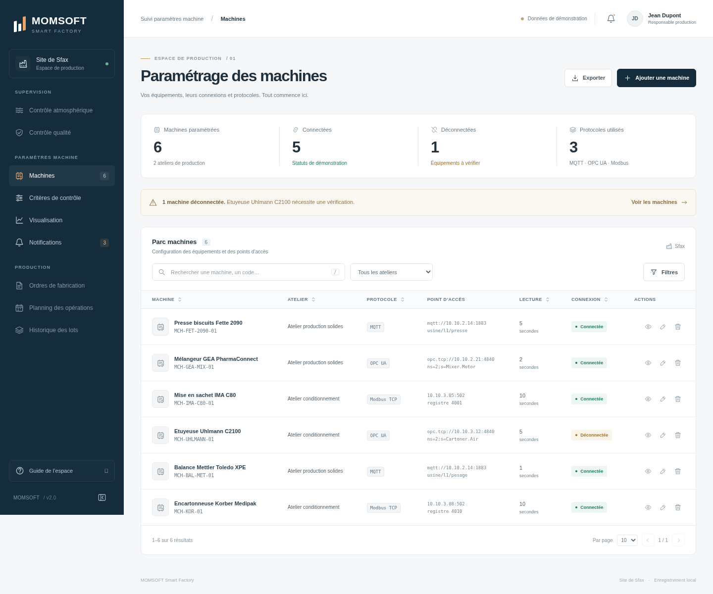
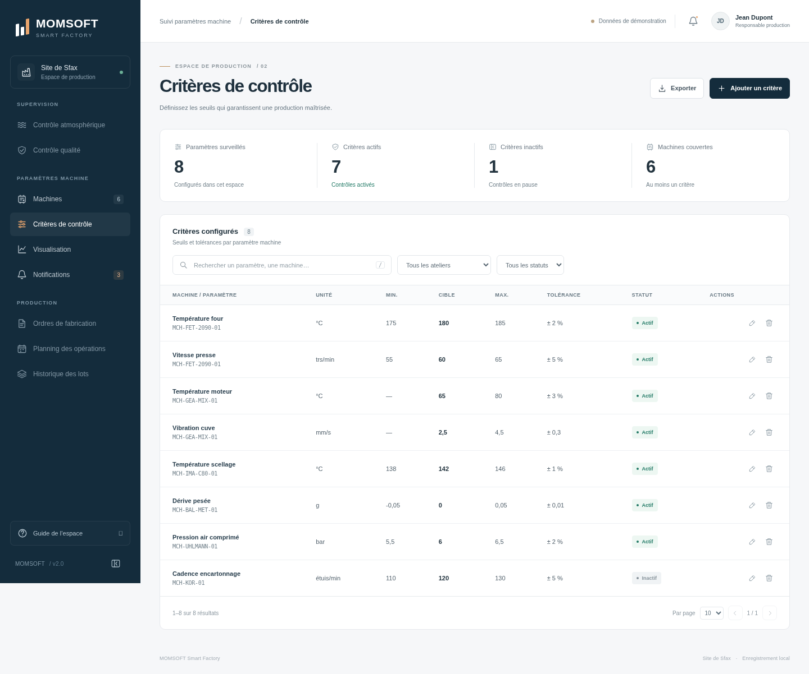
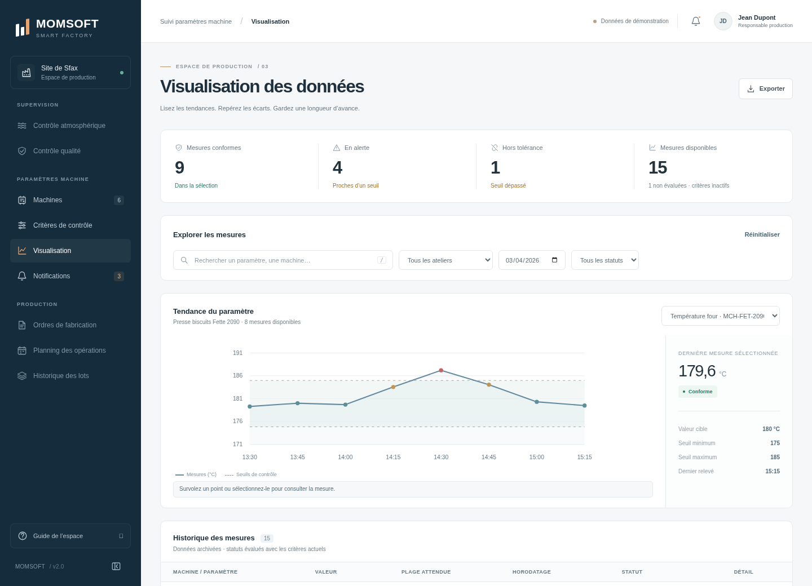
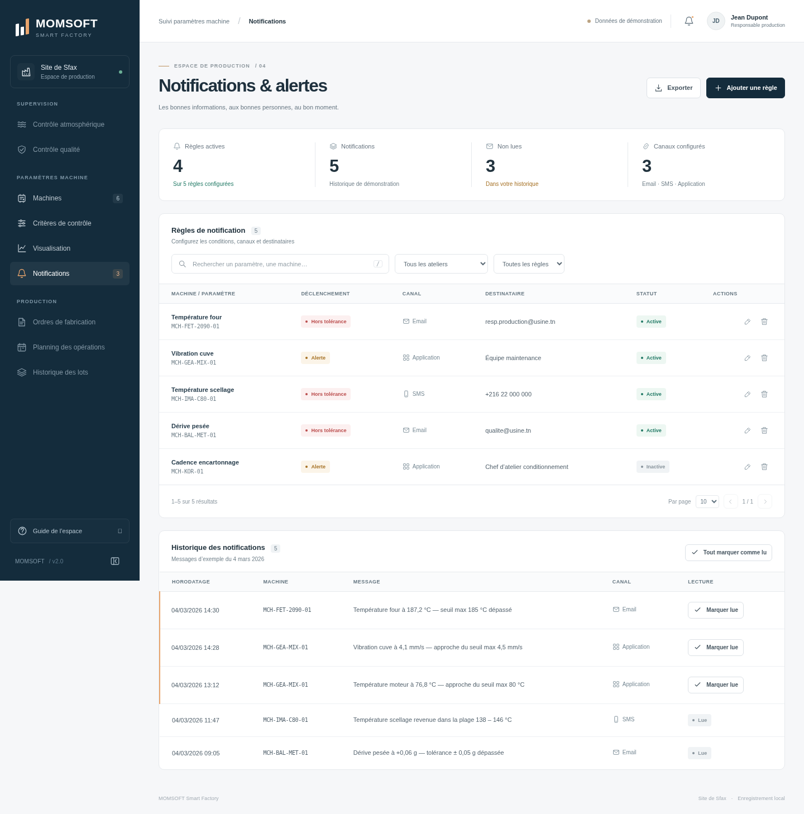
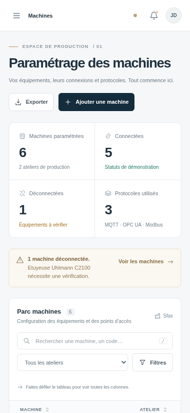
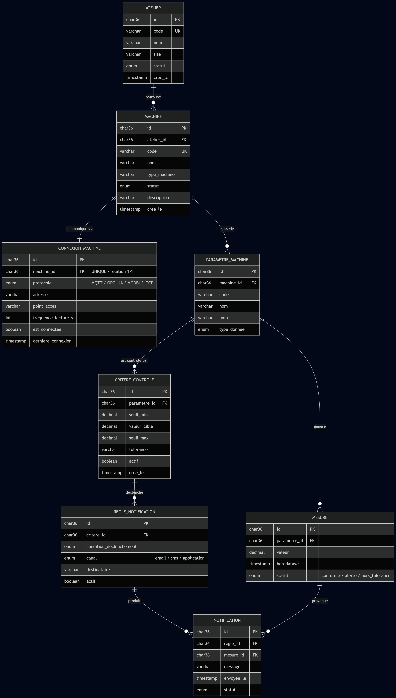

  

<h1 align="center">Suivi des paramètres machine</h1>

  <strong>Configurer les équipements. Maîtriser les seuils. Comprendre les mesures.</strong> 
  Un espace de supervision industrielle développé dans le cadre de mon stage chez <a href="https://www.mom-software.com/">MOMsoft</a>.

  
  
  
  
  

  <a href="https://momsoft-internship.pages.dev/"><strong>Voir la démo</strong></a> &nbsp;·&nbsp;
  <a href="#aperçu">Aperçu</a> &nbsp;·&nbsp;
  <a href="#le-projet">Le projet</a> &nbsp;·&nbsp;
  <a href="#démarrage-rapide">Démarrage rapide</a> &nbsp;·&nbsp;
  <a href="#fonctionnalités">Fonctionnalités</a> &nbsp;·&nbsp;
  <a href="#documentation--modèle-de-données">Documentation</a>

---

## Aperçu

Un tableau de bord dédié au suivi des équipements : un parc machines lisible, des statuts explicites et une configuration accessible depuis un même espace.

  <a href="https://momsoft-internship.pages.dev/"><strong>→ Ouvrir l’application en ligne</strong></a>

<strong>Explorer les autres écrans et la version mobile</strong>

 

<table>
  <tr>
    <td width="50%" align="center">
      <strong>Critères de contrôle</strong> 
      Seuils, valeurs cibles et tolérances par paramètre.  
      
    </td>
    <td width="50%" align="center">
      <strong>Visualisation des données</strong> 
      Courbe interactive, seuils et historique des mesures.  
      
    </td>
  </tr>
  <tr>
    <td width="50%" align="center">
      <strong>Notifications &amp; alertes</strong> 
      Règles, destinataires et suivi des messages lus.  
      
    </td>
    <td width="50%" align="center">
      <strong>Un espace qui s’adapte</strong> 
      Navigation mobile et tableaux à défilement horizontal.  
      
    </td>
  </tr>
</table>

Les captures proviennent de cette application et de ses données d’exemple. Cliquez sur une image pour la consulter en taille réelle.

## Le projet

Je suis **[Wissem Kooli](https://github.com/wissemkooli)** et ce dépôt présente le travail réalisé dans le cadre de mon stage chez **[MOMsoft](https://www.mom-software.com/)**, un éditeur-intégrateur spécialisé dans la digitalisation des opérations industrielles. Sa suite Smart Factory s’inscrit dans l’univers MOM/MES : production, qualité, maintenance et amélioration continue.

Ce projet se concentre sur un module précis : **le suivi des paramètres machine**. L’objectif est de réunir la configuration des équipements, les critères de contrôle, la lecture des mesures et les règles d’alerte dans une interface cohérente.

Le prototype HTML/CSS initial a évolué vers un frontend interactif, tout en conservant les quatre écrans, les exemples métier et les documents de conception d’origine. Le **site de Sfax** est le site de production utilisé dans les données de démonstration.

> **Périmètre actuel :** un frontend fonctionnel avec sauvegarde dans le navigateur. La collecte réelle des données machine, la connexion à MySQL et l’envoi d’emails/SMS nécessitent un backend.

## Démarrage rapide

**Prérequis :** Node.js **18 ou plus récent** et un navigateur moderne.

~~~sh
git clone https://github.com/wissemkooli/Momsoft-Internship.git
cd Momsoft-Internship
npm start
~~~

Ouvrez **[http://127.0.0.1:8000](http://127.0.0.1:8000)**.

**Aucune installation de dépendances et aucune compilation ne sont nécessaires pour lancer l’application.** Les dépendances npm servent uniquement aux tests.

Autres façons de lancer le frontend

 

Pour un aperçu rapide, ouvrez directement [index.html](index.html) dans le navigateur. L’accès au stockage local depuis un fichier dépend du navigateur ; le serveur local est préférable.

Pour servir l’application sur un hébergement statique, publiez ces cinq fichiers dans le même dossier :

~~~text
index.html
style.css
app.js
data.js
favicon.svg
~~~

Le serveur de développement utilise le port 8000 par défaut. Un autre port peut être défini avec la variable d’environnement <code>PORT</code>.

## Déploiement Cloudflare

La version publique est disponible à l’adresse **[momsoft-internship.pages.dev](https://momsoft-internship.pages.dev/)**. Chaque mise à jour de la branche <code>main</code> déclenche un nouveau déploiement depuis GitHub.

Le dépôt contient une configuration prête pour **Workers Static Assets**. Le script de préparation copie uniquement les cinq fichiers frontend dans <code>public/</code>. Les dépendances, tests, documents et fichiers Git ne sont pas publiés comme assets du site.

Dans les paramètres de build du Worker <code>momsoft-internship</code> :

| Paramètre | Valeur |
| :--- | :--- |
| Branche de production | <code>main</code> |
| Répertoire racine | Racine du dépôt |
| Commande de build | Laisser vide |
| Commande de déploiement | <code>npx wrangler deploy</code> |

Wrangler utilise <code>wrangler.jsonc</code> et exécute automatiquement <code>npm run build</code> avant le déploiement. Le dossier d’assets est <strong><code>./public</code></strong>, jamais la racine du dépôt : cela évite notamment de publier <code>node_modules</code>.

Après un déploiement réussi, le lien public est affiché dans Cloudflare, sous <strong>Domains</strong>. Un domaine personnalisé peut être associé au même projet.

Pour vérifier la préparation des fichiers en local, sans installation de dépendances :

~~~sh
npm run build
npm run test:build
~~~

## Fonctionnalités

| Espace | Ce que vous pouvez faire |
| :--- | :--- |
| **Machines** | Ajouter, modifier, consulter et supprimer un équipement ; configurer MQTT, OPC UA ou Modbus TCP ; filtrer par atelier, protocole et connexion. |
| **Critères de contrôle** | Définir les seuils minimum/maximum, la valeur cible et la tolérance ; activer ou mettre en pause un critère ; vérifier la cohérence des valeurs. |
| **Visualisation** | Explorer les relevés par date, atelier et statut ; changer le paramètre du graphique ; consulter les points et les détails d’une mesure. |
| **Notifications** | Configurer les conditions, canaux et destinataires ; modifier les règles ; marquer une notification ou tout l’historique comme lu. |

Les quatre écrans partagent une recherche insensible aux accents, des filtres et la pagination. Le parc machines propose également le tri. Les exports CSV contiennent **toute la liste filtrée**, même lorsqu’elle s’étend sur plusieurs pages.

La navigation utilise des liens partageables, une barre latérale rétractable et un menu mobile. Les fenêtres de configuration sont accessibles au clavier ; **/** ouvre la recherche et **Échap** ferme une fenêtre ou le menu mobile.

### Des données cohérentes entre les écrans

Une modification met à jour les listes et les indicateurs concernés. Les changements sont sauvegardés dans le navigateur et synchronisés entre les onglets de la même application.

Les suppressions demandent une confirmation qui précise leurs conséquences :

- **Machine :** suppression de ses critères, mesures, règles et notifications locales.
- **Critère :** suppression de ses mesures et règles ; conservation des notifications historiques.
- **Règle :** suppression de sa configuration ; conservation des notifications historiques.

## Architecture

Le frontend utilise **HTML, CSS et JavaScript natif**, sans framework ni dépendance à l’exécution. Le serveur Node.js est un outil d’aperçu local ; il ne constitue pas un backend métier.

~~~text
Momsoft-Internship/
├── index.html                 Structure de l’application
├── style.css                  Design, composants et responsive
├── app.js                     Navigation, formulaires et interactions
├── data.js                    Données métier de démonstration
├── favicon.svg                Icône de l’application
├── scripts/
│   ├── build.cjs              Préparation des cinq assets publics
│   └── serve.cjs              Serveur d’aperçu local
├── tests/
│   ├── build.cjs              Vérification du paquet de déploiement
│   └── frontend.cjs           Tests navigateur Playwright
├── docs/
│   └── images/                Logo et captures de l’interface
├── schema.sql                 Schéma MySQL et données initiales
├── Diagramme.png              Modèle relationnel d’origine
├── Document-technique-Suivi-parametres-machine.docx
├── package.json
├── wrangler.jsonc             Configuration Cloudflare Workers
├── README.md
└── LICENSE
~~~

### Données de démonstration

Le jeu initial comprend **6 machines**, **2 ateliers**, **8 critères**, **3 protocoles**, **15 relevés**, **5 règles** et **5 notifications**. Les relevés datent du **4 mars 2026** ; aucune nouvelle mesure n’est générée automatiquement.

La sauvegarde utilise la clé <code>momsoft.factory.v2</code> dans <code>localStorage</code>. Elle est propre au navigateur et à l’origine de l’application : les données ne sont pas partagées entre utilisateurs ou appareils. Effacer les données de navigation efface les modifications locales.

Le guide de l’espace permet de **restaurer les exemples initiaux** après confirmation. Si le navigateur bloque le stockage, l’interface indique que les changements ne sont conservés que pour la session.

<strong>Comment les statuts des mesures sont-ils calculés ?</strong>

 

| Statut | Interprétation |
| :--- | :--- |
| **Conforme** | Valeur à l’intérieur des seuils et en dehors de la zone d’alerte. |
| **Alerte** | Valeur proche d’un seuil, sans le dépasser. |
| **Hors tolérance** | Valeur inférieure au minimum ou supérieure au maximum. |
| **Non évaluée** | Critère de contrôle inactif. |

La zone d’alerte commence à une distance du seuil égale au **maximum entre la tolérance et 10 % de la plage**, avec une marge limitée à la moitié de la plage. Pour un seuil unique, la plage utilisée correspond à la valeur absolue de ce seuil. Une tolérance en pourcentage est calculée à partir de la valeur cible, ou de la mesure lorsque la cible est absente.

Les statuts des relevés historiques sont recalculés avec les critères actuels. Les messages de notification archivés restent inchangés.

### Ce qui reste à connecter

Les statuts de connexion, le profil et les notifications sont des exemples. Le frontend ne communique pas avec les appareils et **n’envoie aucun email ou SMS**. Les prochaines intégrations métier reposeraient sur le schéma existant : API et persistance MySQL, collecte MQTT/OPC UA/Modbus, authentification et service de notification.

## Documentation & modèle de données

| Ressource | Contenu |
| :--- | :--- |
| [Document technique](Document-technique-Suivi-parametres-machine.docx) | Document de conception du module de suivi des paramètres machine. |
| [Schéma SQL](schema.sql) | Tables MySQL, relations et données d’exemple. |
| [Diagramme relationnel](Diagramme.png) | Relations entre ateliers, machines, connexions, paramètres, critères, mesures et notifications. |
| [Site de MOMsoft](https://www.mom-software.com/) | Présentation de l’entreprise d’accueil et de ses solutions industrielles. |

<strong>Afficher le diagramme relationnel</strong>

 

## Vérification

Installez les outils de test, puis lancez les vérifications :

~~~sh
npm install
npx playwright install chromium
npm run check
npm test
~~~

La suite comporte **10 tests navigateur** couvrant la recherche, les filtres, les formulaires, la validation des seuils, les suppressions en cascade, les graphiques, les exports CSV, la sauvegarde, la synchronisation entre onglets et la navigation mobile, ainsi que **2 tests de déploiement** vérifiant le contenu de <code>public/</code> et la configuration Wrangler. Les tests navigateur utilisent un serveur local sur un port libre ; aucun service externe n’est nécessaire pendant leur exécution.

Pour utiliser un Chromium déjà installé :

~~~sh
BROWSER_PATH=/usr/bin/chromium npm test
~~~

## Auteur & crédits

**[Wissem Kooli](https://github.com/wissemkooli)** · Projet de stage chez **[MOMsoft](https://www.mom-software.com/)**.

Le logo Smart Factory est issu du [site officiel de MOMsoft](https://www.mom-software.com/wp-content/uploads/2025/07/Group-6.png). Les captures montrent le frontend de ce dépôt. Le schéma SQL, le diagramme et le document technique sont les ressources de conception conservées du projet initial.

Le code est distribué sous [licence MIT](LICENSE).

---

  <a href="https://www.mom-software.com/"><strong>MOMsoft</strong></a> 
  Digitalisation industrielle · Smart Factory · Projet de stage

